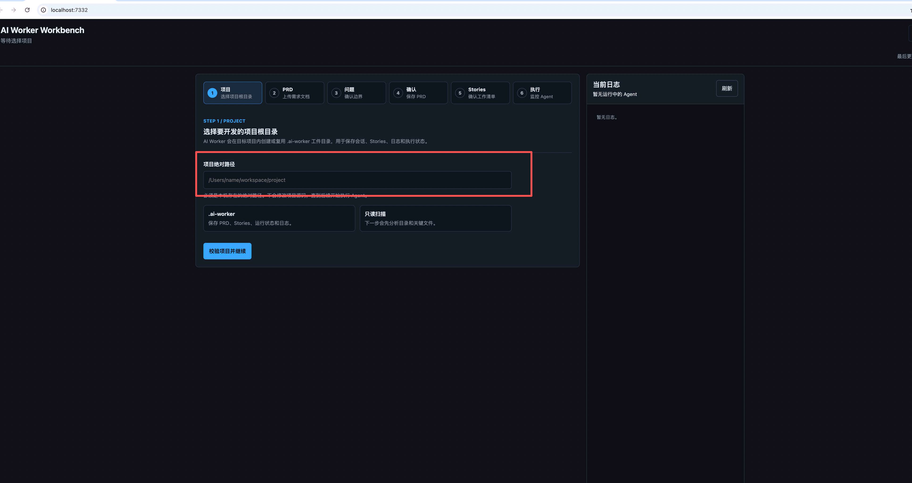
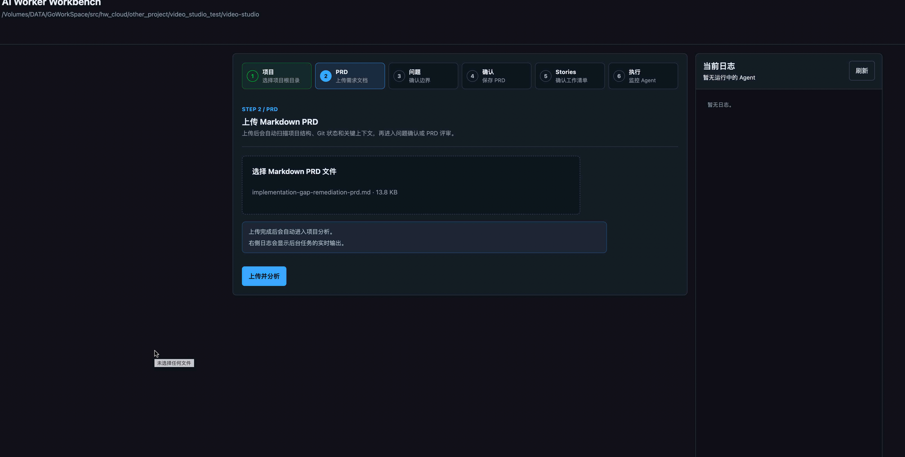
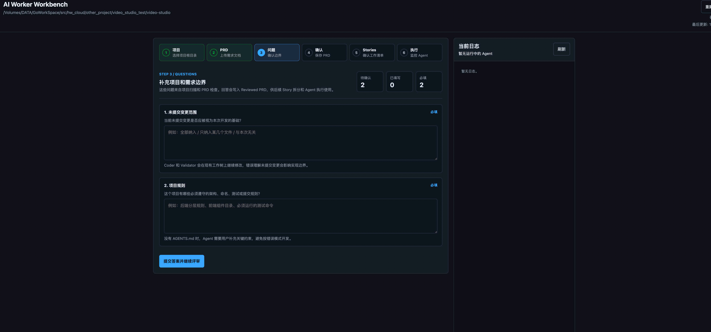
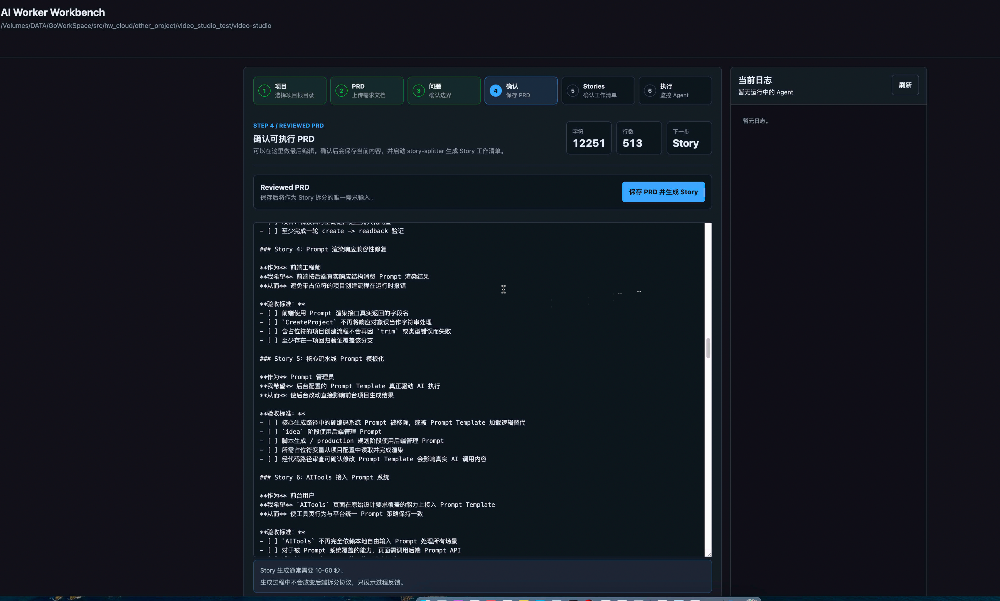
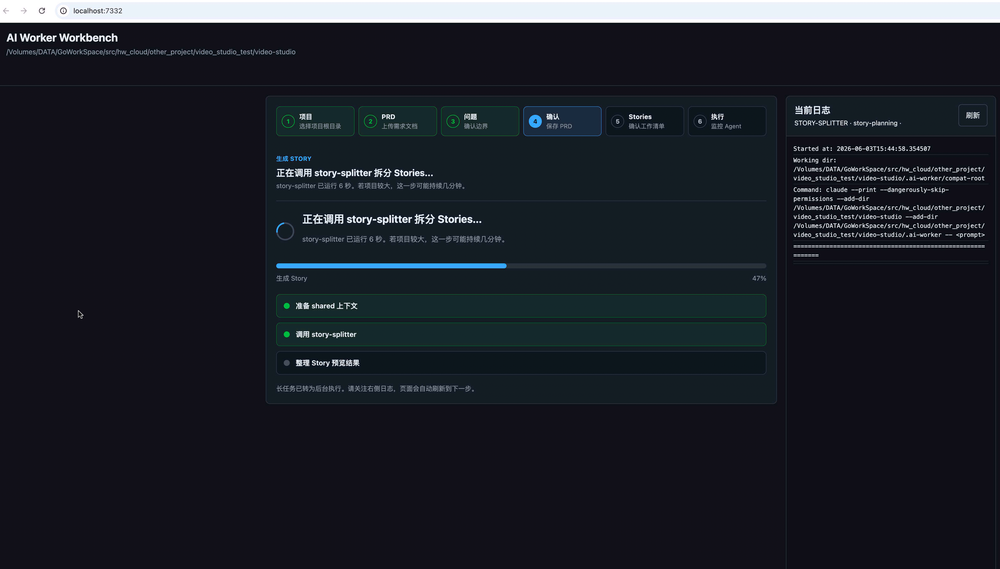
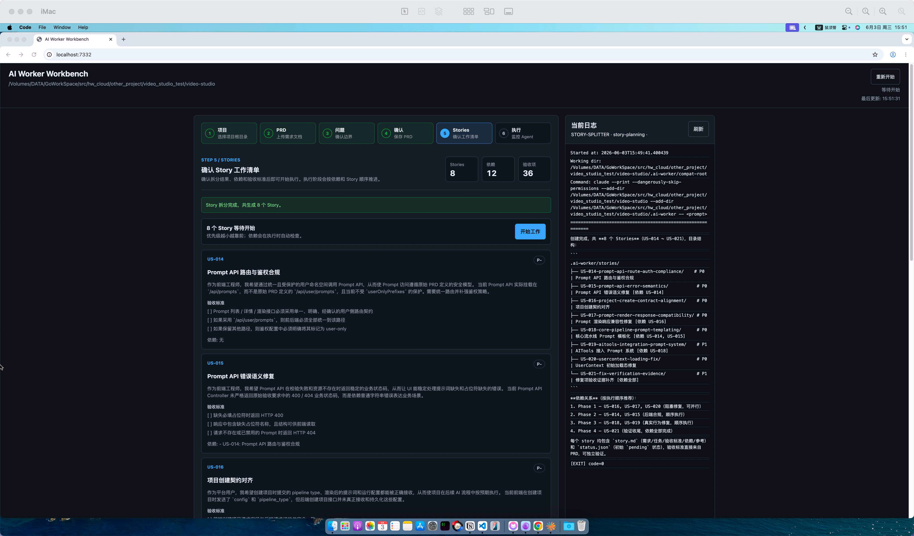
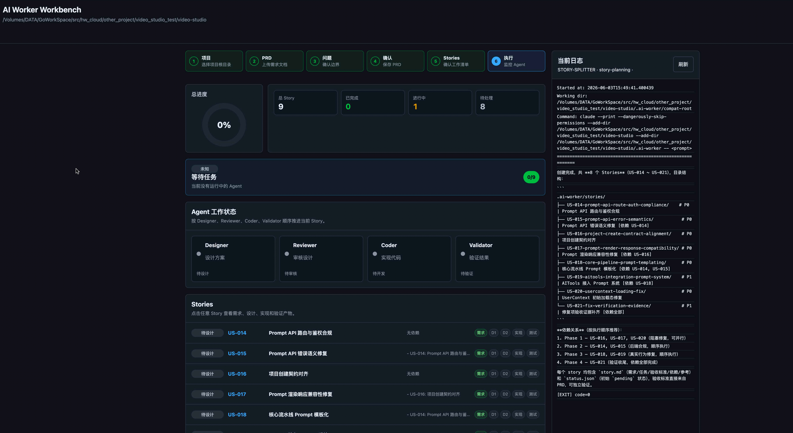
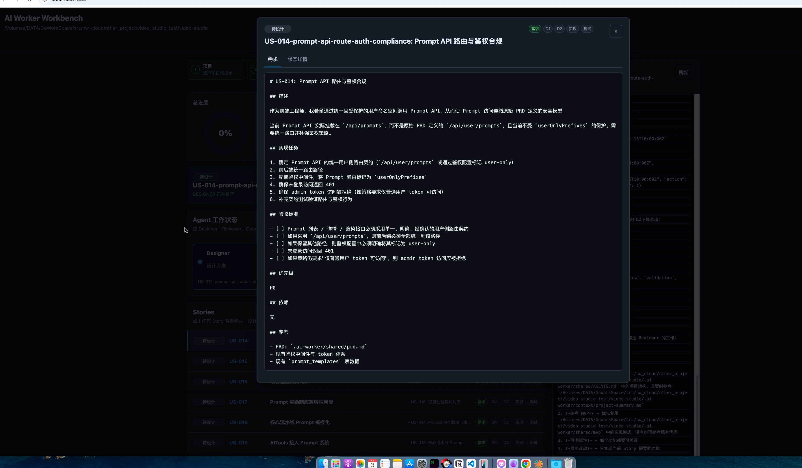

# ai_auto_working_stiff

一个面向本地项目的 AI Worker 工作台, AI 牛马。

它的作用不是直接承载业务代码，而是把一个已有的本地项目接入到受控的 AI 开发流程中：先分析项目和 PRD，再拆分 Story，最后按 `Designer -> Reviewer -> Coder -> Validator` 的固定顺序执行开发。

## 项目用途

这个仓库主要解决两类问题：

1. 把“给 AI 一份 PRD 然后开始改代码”的过程做成可视化、可追踪、可回放的流程。
2. 把 AI 开发行为限制在明确的阶段和工件里，避免直接无约束地修改项目。

适合的场景包括：

- 你已经有一个本地项目，希望让 AI 基于 PRD 持续开发。
- 你希望在开发前先让系统扫描项目结构、README、关键配置和 Git 状态。
- 你希望先把需求整理清楚，再拆成 Story，再开始执行。
- 你希望保留每个阶段的产出、日志和验证记录，便于审计和回看。

## 核心流程

推荐使用 Web 工作台完成完整流程：

1. 选择目标项目根目录。
2. 上传 Markdown 格式的 PRD。
3. 系统扫描目标项目结构、关键文件和 Git 状态。
4. 如果信息不足，系统会生成问题让用户补充。
5. 系统整理出可执行的 PRD。
6. 系统将 PRD 拆分为 Stories，供用户预览确认。
7. 用户点击开始后，Worker 依次执行 4 个 Agent：
   - `Designer`：输出设计稿 `design-v1.md`
   - `Reviewer`：审核并修正设计，输出 `design-v2.md`
   - `Coder`：按设计修改目标项目代码并记录实现说明
   - `Validator`：运行验证并产出测试报告

只有 Validator 通过后，Story 才会进入 `done`；失败时会退回开发阶段继续修复。

## 仓库定位

这个仓库本身是 Worker 平台，核心代码在 [new_code/worker](/Volumes/DATA/GoWorkSpace/src/github.com/ai_auto_working_stiff/new_code/worker)。

实际被修改的业务代码不在本仓库内部，而是在你通过 UI 选择的“目标项目根目录”里。执行过程中产生的工件默认写入目标项目下的 `.ai-worker/` 目录。

## 启动方式

### 方式一：使用 VS Code 调试启动（推荐）

当前更推荐通过 VS Code 调试方式启动 Worker，而不是直接在终端后台跑命令。

原因：

- `claude` CLI 在长时间运行时可能出现不稳定情况，调试方式更方便观察当前状态
- 可以直接在 VS Code 里看进程、断点、输出和异常
- Runner 本身已经兼容 IDE 调试启动场景
- 调试模式下即使返回非零退出码，也不会像普通 CLI 那样直接退出进程

推荐调试目标是 `new_code/worker/worker.py`，并同时带上 `--ui`，这样可以一边在 VS Code 中观察后台执行，一边在浏览器中操作工作台。

建议在项目根目录创建 `.vscode/launch.json`，加入下面这个配置：

```json
{
  "version": "0.2.0",
  "configurations": [
    {
      "name": "AI Worker Debug",
      "type": "debugpy",
      "request": "launch",
      "program": "${workspaceFolder}/new_code/worker/worker.py",
      "cwd": "${workspaceFolder}/new_code/worker",
      "console": "integratedTerminal",
      "args": [
        "--project-root",
        "/abs/path/to/your-project",
        "--artifact-root",
        "/abs/path/to/your-project/.ai-worker",
        "--max-iterations",
        "1000",
        "--ui"
      ]
    }
  ]
}
```

启动步骤：

1. 在 VS Code 中打开当前仓库
2. 打开“运行和调试”
3. 选择 `AI Worker Debug`
4. 点击启动
5. 浏览器访问 `http://localhost:7332`

说明：

- 服务默认监听 `127.0.0.1:7332`
- UI 用于项目接入、PRD 上传、问题确认、Story 预览和运行监控
- 通过调试器启动后，更方便观察 `claude` 调用异常、Runner 卡住位置和当前 Story 状态

### 方式二：命令行直接启动 Runner

如果只是临时运行，也可以手动启动 Runner：

```bash
python3 new_code/worker/worker.py \
  --project-root /abs/path/to/your-project \
  --artifact-root /abs/path/to/your-project/.ai-worker \
  --max-iterations 1000 \
  --ui
```

可选参数：

- `--max-iterations`：最大轮询迭代次数，默认 `100`
- `--ui`：同时启动 Web UI
- `--open-browser`：启动后自动打开浏览器

这种方式适合快速试跑，但如果要长期挂着观察状态，还是建议优先用 VS Code 调试方式。

## 使用步骤

### 1. 准备环境

运行这个项目至少需要：

- `python3`
- `claude` CLI
- 系统 `script` 命令（Worker 用它给 Agent 提供 PTY）
- `git`（建议安装，项目分析阶段会读取分支、未提交变更和最近提交）

当前 Python 代码只使用标准库，没有单独的第三方依赖清单。

### 2. 通过 VS Code 启动 Worker

推荐直接调试启动 [new_code/worker/worker.py](/Volumes/DATA/GoWorkSpace/src/github.com/ai_auto_working_stiff/new_code/worker/worker.py)，并带上 `--ui` 参数，让 Runner 和 Web 工作台一起运行。

如果你已经按上面的示例配置了 `launch.json`，直接在 VS Code 中启动 `AI Worker Debug` 即可。

### 3. 在页面中完成接入

按顺序完成：

1. 输入目标项目绝对路径
2. 上传 `.md` 或 `.markdown` 格式的 PRD
3. 查看系统生成的项目分析结果
4. 回答系统提出的问题
5. 确认整理后的 PRD
6. 预览 Stories
7. 点击开始执行

### 4. 查看运行结果

运行期间可以在 UI 中看到：

- 当前 Story
- 当前 Agent
- 每个 Agent 的阶段状态
- 调试器里的 Python 进程状态
- Worker 主日志
- 当前 Agent 实时日志
- Story 详情和阶段产物

## 目录结构

仓库内核心结构如下：

```text
.
├── README.md
├── 开发需求.md
└── new_code/
    └── worker/
        ├── worker.py
        ├── config.json
        ├── README.md
        ├── active_session.json
        ├── worker_state.json
        ├── agents/
        │   ├── designer.md
        │   ├── reviewer.md
        │   ├── coder.md
        │   ├── validator.md
        │   ├── project_analyst.md
        │   ├── prd_reviewer.md
        │   └── story_planner.md
        ├── ui/
        │   ├── server.py
        │   ├── index.html
        │   ├── app.js
        │   └── style.css
        └── logs/
```

目标项目被接入后，会生成这样的工件目录：

```text
<projectRoot>/.ai-worker/
├── session.json
├── worker_state.json
├── context/
│   ├── raw-prd.md
│   ├── reviewed-prd.md
│   ├── project-summary.md
│   ├── project-analysis.json
│   ├── questions.json
│   └── answers.json
├── shared/
├── stories/
├── logs/
└── screenshots/
```

## 关键文件说明

- [README.md](/Volumes/DATA/GoWorkSpace/src/github.com/ai_auto_working_stiff/README.md)：项目总说明和推荐使用方式
- [new_code/worker/worker.py](/Volumes/DATA/GoWorkSpace/src/github.com/ai_auto_working_stiff/new_code/worker/worker.py)：Worker Runner，负责 Story 调度和 Agent 顺序执行
- [new_code/worker/ui/server.py](/Volumes/DATA/GoWorkSpace/src/github.com/ai_auto_working_stiff/new_code/worker/ui/server.py)：Web UI 服务端和会话 API
- [new_code/worker/ui/app.js](/Volumes/DATA/GoWorkSpace/src/github.com/ai_auto_working_stiff/new_code/worker/ui/app.js)：前端交互逻辑
- [new_code/worker/ui/style.css](/Volumes/DATA/GoWorkSpace/src/github.com/ai_auto_working_stiff/new_code/worker/ui/style.css)：UI 样式
- [new_code/worker/agents](/Volumes/DATA/GoWorkSpace/src/github.com/ai_auto_working_stiff/new_code/worker/agents)：各阶段 Agent 提示词
- [new_code/worker/config.json](/Volumes/DATA/GoWorkSpace/src/github.com/ai_auto_working_stiff/new_code/worker/config.json)：超时、轮询和 UI 端口等配置

## API 概览

UI 主要使用这些接口：

- `GET /api/session`
- `POST /api/session/project`
- `POST /api/session/prd`
- `POST /api/session/analyze`
- `POST /api/session/answers`
- `POST /api/session/prd/confirm`
- `POST /api/session/stories/generate`
- `POST /api/session/start`
- `GET /api/logs/current-agent`
- `GET /api/logs/worker`

兼容旧接口：

- `GET /api/status`
- `GET /api/stories`
- `GET /api/story/{story-id}`
- `GET /api/logs`

## 运行机制

### 项目分析阶段

UI Server 会读取目标项目的以下信息：

- 目录树摘要
- `README.md`、`package.json`、`go.mod`、`pyproject.toml`、`Cargo.toml`、`Makefile` 等关键文件
- `docs/*.md`
- Git 当前分支、未提交变更、最近提交记录

如果信息不完整，系统会生成问题让用户补充，之后再整理成可执行 PRD。

### Story 执行阶段

Runner 按 Story 顺序工作，并根据 `status.json.phase` 决定调用哪个 Agent：

- `pending` -> `designer`
- `designed` -> `reviewer`
- `design_reviewed` / `coding` -> `coder`
- `coding_complete` -> `validator`
- `done` -> 已完成

### 日志与状态

运行过程中会持续写入：

- `worker_state.json`：全局运行状态
- `logs/worker-YYYYMMDD.log`：Worker 主日志
- `logs/YYYYMMDD-HHMMSS-{agent}-{story-id}.log`：Agent 执行日志

## 适用边界

这个项目更像“AI 开发调度台”，不是通用的代码生成脚本。使用时有几个前提：

- 目标项目最好已经能在本地正常开发和验证
- 目标项目需要有相对清晰的目录结构和基础说明
- PRD 最好使用 Markdown 编写
- 验证阶段依赖目标项目自身的测试或构建命令

如果目标项目完全没有说明、无法本地运行，或者没有任何可执行验证手段，Worker 的效果会明显下降。

## 常见问题

### 1. 为什么启动的是这个仓库，但改动出现在别的项目里？

因为这个仓库负责“流程编排”。真正的开发对象是你在 UI 里选择的目标项目，执行工件默认写入那个项目的 `.ai-worker/` 目录。

### 2. 为什么需要 `claude` CLI？

四个执行阶段的 Agent 是通过 `claude --print` 调用的，没有这个 CLI 就无法进入实际的设计、编码和验证流程。

### 3. 为什么这里推荐用 VS Code 调试启动？

因为这个项目是长生命周期流程，`claude` 调用也可能不稳定。用 VS Code 调试运行时，更容易定位卡住位置、查看输出、保留现场并手动恢复。

### 4. 为什么推荐先走 UI，不直接跑 `worker.py`？

因为当前主流程已经包含项目扫描、问题补充、PRD 整理和 Story 预览。直接运行 `worker.py` 更适合已有工件目录、明确知道自己在做什么的场景。

## 补充说明

[new_code/worker/README.md](/Volumes/DATA/GoWorkSpace/src/github.com/ai_auto_working_stiff/new_code/worker/README.md) 还保留了一部分旧版兼容流程说明，适合用来理解底层 Runner 的历史设计；实际使用时，以本 README 中描述的 Web 工作台流程为准。





， 这里如果点击之后出现问题，请刷新页面，由于跨路径问题，拆分状态可能会第一次显示不出来。



